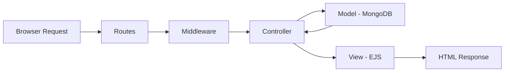
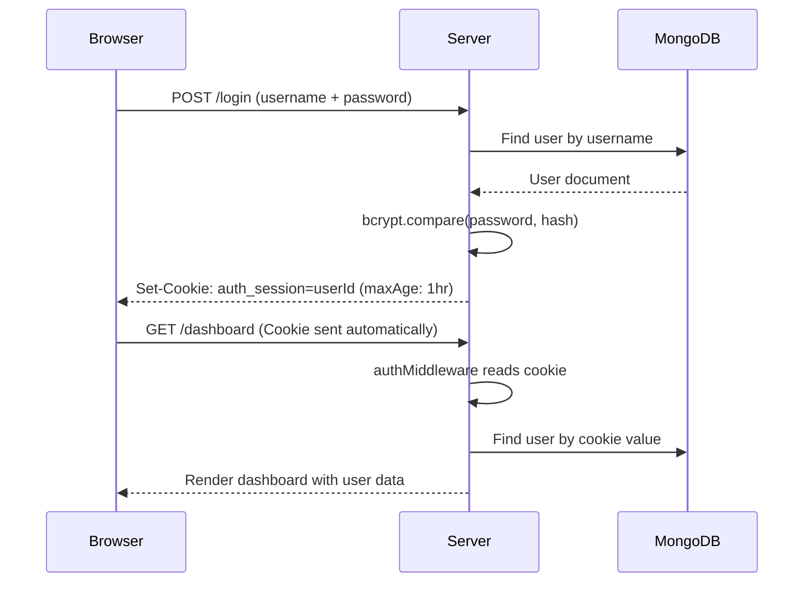

# 🎬 Neo-Cinema Hub — Complete Project Explanation & Video Script

---

## 📌 Part 1: Project Overview (What Is This Project?)

**Neo-Cinema Hub** is a **full-stack Movie Booking & Management web application** built with **Node.js, Express, MongoDB, and EJS**. It uses **cookie-based authentication** (no JWT, no Passport.js) to manage user sessions.

### Why Is This Project Helpful?

| Reason | Explanation |
|--------|-------------|
| **Learn Cookie-Based Auth** | Understand how sessions work using HTTP cookies — the foundation before learning JWT/OAuth |
| **Full MVC Architecture** | Industry-standard pattern: Models → Controllers → Routes → Views |
| **Real-World CRUD** | Create, Read, Update, Delete on Movies, Bookings, Reviews, Users |
| **Role-Based Access** | Admin vs User roles — real authorization logic |
| **File Uploads** | Learn Multer for uploading movie posters and user avatars |
| **Password Security** | Bcrypt hashing — never store plain passwords |
| **College/Portfolio Project** | Covers all concepts asked in interviews: Auth, CRUD, MVC, DB, Middleware |

---

## 📦 Part 2: NPM Packages — What We Installed & Why

### Production Dependencies

```bash
npm install express mongoose ejs bcryptjs cookie-parser dotenv multer
```

| # | Package | Version | Purpose |
|---|---------|---------|---------|
| 1 | **express** | ^4.18.2 | Web framework — handles routes, middleware, HTTP requests/responses |
| 2 | **mongoose** | ^7.5.0 | MongoDB ODM — defines schemas, models, and queries the database |
| 3 | **ejs** | ^3.1.9 | Templating engine — renders dynamic HTML pages with server data |
| 4 | **bcryptjs** | ^3.0.3 | Password hashing — encrypts passwords before saving to DB |
| 5 | **cookie-parser** | ^1.4.6 | Parses cookies from HTTP requests — reads `auth_session` cookie |
| 6 | **dotenv** | ^17.4.2 | Loads `.env` variables (DB URI, port, session age) into `process.env` |
| 7 | **multer** | ^2.1.1 | File upload middleware — handles poster & avatar image uploads |

### Dev Dependencies

```bash
npm install --save-dev nodemon
```

| # | Package | Version | Purpose |
|---|---------|---------|---------|
| 1 | **nodemon** | ^3.0.0 | Auto-restarts server on file changes during development |

---

## 🏗️ Part 3: Folder Structure (MVC Pattern)

```
Auth with cookies/
├── server.js                  ← Entry point — Express app setup
├── .env                       ← Environment variables (DB URI, Port, Session Age)
├── package.json               ← NPM config & dependencies
│
├── models/                    ← M — Mongoose Schemas (Database Structure)
│   ├── User.js                ← User schema (username, password, role, watchlist, theme)
│   ├── Movie.js               ← Movie schema (title, director, genre, rating, price, poster)
│   ├── Booking.js             ← Booking schema (movie, user, date, time, seats, price)
│   └── Review.js              ← Review schema (movie, user, rating, text)
│
├── controllers/               ← C — Business Logic (What happens on each request)
│   ├── authController.js      ← Signup, Login, Logout logic
│   ├── movieController.js     ← Dashboard, CRUD movies, reviews, watchlist, theme
│   ├── bookingController.js   ← Create/cancel bookings, view booking history
│   ├── adminController.js     ← Admin panel: manage users, movies, stats
│   └── settingsController.js  ← Profile edit, password change, account delete
│
├── routes/                    ← URL → Controller mapping
│   ├── authRoutes.js          ← /login, /signup, /logout, /settings routes
│   └── movieRoutes.js         ← /dashboard, /movies, /bookings, /admin routes
│
├── middleware/                ← Request interceptors (run BEFORE controllers)
│   ├── authMiddleware.js      ← requireSession & redirectIfAuthenticated
│   └── upload.js              ← Multer config for poster & avatar uploads
│
├── views/                     ← V — EJS Templates (What the user sees)
│   ├── login.ejs              ← Login page
│   ├── signup.ejs             ← Signup page
│   ├── dashboard.ejs          ← Main dashboard with movie cards
│   ├── movieDetail.ejs        ← Single movie details + reviews
│   ├── bookings.ejs           ← User's booking history
│   ├── watchlist.ejs          ← Saved movies list
│   ├── settings.ejs           ← Profile & account settings
│   └── admin.ejs              ← Admin dashboard
│
└── public/                    ← Static files served to browser
    ├── style.css              ← All CSS (glassmorphic dark theme, 79KB!)
    └── uploads/               ← Uploaded images
        ├── posters/           ← Movie poster images
        └── avatars/           ← User profile pictures
```

### Why MVC?



> **Model** = Data structure & DB queries  
> **View** = What user sees (HTML/EJS)  
> **Controller** = Logic connecting Model ↔ View

---

## ⚙️ Part 4: Core Functionalities Explained

### 🔐 1. Cookie-Based Authentication

**How it works (step by step):**



**Key code in `authController.js`:**
- On login → `res.cookie('auth_session', user._id, { httpOnly: true, maxAge: 1hr })`
- On logout → `res.clearCookie('auth_session')`
- Cookie expires automatically after `SESSION_MAX_AGE` (1 hour)

**Key code in `authMiddleware.js`:**
- `requireSession` → Checks cookie exists → finds user in DB → attaches `req.user`
- `redirectIfAuthenticated` → If already logged in, skip login/signup pages

### 🎬 2. Movie Management (Full CRUD)

| Operation | Route | What Happens |
|-----------|-------|-------------|
| **Create** | `POST /movies/add` | Add movie with title, director, genre, rating, poster upload |
| **Read** | `GET /dashboard` | View all your movies with pagination (12/page) |
| **Update** | `POST /movies/update/:id` | Edit movie details, change poster |
| **Delete** | `POST /movies/delete/:id` | Remove movie + its reviews |

### 🎟️ 3. Ticket Booking System

- Select movie → choose date, time slot, number of seats (1-10)
- 5 time slots: `10:00 AM, 1:30 PM, 4:00 PM, 6:30 PM, 9:30 PM`
- Price auto-calculated: `seats × ticketPrice`
- Booking can be **cancelled** (status changes to 'cancelled')
- Booking history page with stats (total spent, active bookings, cancelled count)

### ⭐ 4. Review System

- Rate movies 1-10 + write a text review (max 500 chars)
- One review per user per movie (enforced by compound index)
- Reviews show on movie detail page with user avatar & name
- Users can delete their own reviews

### 📋 5. Watchlist

- Toggle add/remove movies to personal watchlist
- AJAX-based toggle (no page reload)
- Dedicated watchlist page to view saved movies

### 🛡️ 6. Admin Panel

- **Role-based**: Only users with `role: 'admin'` can access `/admin`
- View platform stats: total users, movies, bookings, revenue, reviews
- Genre distribution via MongoDB aggregation pipeline
- Manage users: toggle admin/user role, delete users
- Delete any movie on the platform

### ⚙️ 7. User Settings

- Edit profile: name, bio, favorite genre, profile picture
- Upload avatar (Multer, max 2MB, image files only)
- Change password (requires current password verification)
- Delete account (removes user + all their movies)

### 🌗 8. Theme Toggle (Dark/Light)

- User preference saved in DB (`theme: 'dark' | 'light'`)
- AJAX toggle — no page reload
- Persists across sessions

### 📤 9. File Upload System (Multer)

| Upload Type | Max Size | Allowed Formats | Storage Path |
|------------|----------|-----------------|-------------|
| Movie Poster | 5 MB | jpeg, jpg, png, gif, webp, svg | `/public/uploads/posters/` |
| User Avatar | 2 MB | jpeg, jpg, png, gif, webp, svg | `/public/uploads/avatars/` |

Files get unique names: `timestamp-randomNumber.extension`

---

## 🎥 Part 5: Video Script (Scene by Scene)

---

### 🎬 SCENE 1 — INTRO (30 seconds)

> **You say:**
>
> "Hey everyone! Today I'm going to walk you through my full-stack project called **Neo-Cinema Hub**. This is a complete **Movie Booking and Management System** built using **Node.js, Express, MongoDB, and EJS**."
>
> "The most important thing about this project is — it uses **cookie-based authentication**. No JWT, no Passport.js — just pure **HTTP cookies** to manage user sessions. This is how authentication fundamentally works before you move to tokens."
>
> "Let me show you the tech stack, the architecture, and then a live demo."

---

### 🎬 SCENE 2 — TECH STACK & NPM PACKAGES (2 minutes)

> **Show: `package.json` on screen**
>
> "Let's start with what we installed. Open `package.json` and you can see 7 production packages and 1 dev package."
>
> **Go through each one:**
>
> 1. "**Express** — our web framework. It handles routing, middleware, and HTTP."
> 2. "**Mongoose** — ODM for MongoDB. We define schemas like User, Movie, Booking, Review."
> 3. "**EJS** — our templating engine. Instead of React, we render HTML on the server with dynamic data."
> 4. "**bcryptjs** — this is critical. We NEVER store plain passwords. Bcrypt hashes the password with 12 salt rounds before saving."
> 5. "**cookie-parser** — this reads cookies from the browser request. Our `auth_session` cookie carries the user ID."
> 6. "**dotenv** — loads our `.env` file so we can keep secrets like the MongoDB URI out of the code."
> 7. "**Multer** — handles file uploads. We use it for movie poster uploads and user avatar uploads."
> 8. "**Nodemon** (dev) — auto-restarts the server when we save a file. Just for development convenience."

---

### 🎬 SCENE 3 — FOLDER STRUCTURE & MVC (2 minutes)

> **Show: VS Code file explorer**
>
> "This project follows the **MVC pattern** — Model, View, Controller."
>
> "**Models folder** — 4 files: `User.js`, `Movie.js`, `Booking.js`, `Review.js`. These define our database schemas using Mongoose."
>
> "**Controllers folder** — 5 files. This is where all the business logic lives. Auth controller handles login/signup. Movie controller handles CRUD. Booking controller handles ticket reservations."
>
> "**Routes folder** — 2 files. `authRoutes.js` maps URLs like `/login`, `/signup` to the right controller function. `movieRoutes.js` handles `/dashboard`, `/movies`, `/bookings`, `/admin`."
>
> "**Middleware folder** — 2 files. `authMiddleware.js` checks if the user is logged in before allowing access. `upload.js` configures Multer for file uploads."
>
> "**Views folder** — 8 EJS templates. Login, Signup, Dashboard, Movie Detail, Bookings, Watchlist, Settings, and Admin."
>
> "**Public folder** — CSS file (almost 79KB of premium styling!) and upload directories."
>
> "And `server.js` ties everything together — sets up Express, connects to MongoDB, and mounts the routes."

---

### 🎬 SCENE 4 — AUTHENTICATION FLOW DEEP DIVE (3 minutes)

> **Show: `authController.js` + `authMiddleware.js` on screen**
>
> "Now the core concept — **cookie-based authentication**. Let me trace the complete flow."
>
> "**Step 1 — Signup:** User submits username, password, fullName. We check if username already exists. If not, `User.create()` is called. In the User model, there's a `pre('save')` hook that automatically hashes the password with bcrypt before saving."
>
> "**Step 2 — Set Cookie:** After creating the user, we call `res.cookie('auth_session', user._id)` with these options: `httpOnly: true` so JavaScript can't access it (prevents XSS), `sameSite: 'strict'` to prevent CSRF, and `maxAge: 3600000` which is 1 hour — after that, the cookie expires and the user is logged out automatically."
>
> "**Step 3 — Every Request:** When the user visits `/dashboard`, the browser automatically sends the cookie. Our `requireSession` middleware reads it with `cookie-parser`, validates the ObjectId format, looks up the user in MongoDB, and attaches `req.user`. If anything fails — invalid cookie, user not found — it clears the cookie and redirects to login."
>
> "**Step 4 — Logout:** Simply `res.clearCookie('auth_session')` and redirect to login. The session is gone."
>
> "**Step 5 — Smart Redirects:** `redirectIfAuthenticated` middleware checks if a logged-in user tries to visit `/login` or `/signup` — if so, it sends them straight to `/dashboard`."

---

### 🎬 SCENE 5 — LIVE DEMO (5-7 minutes)

> **Show: Browser running on `localhost:3000`**
>
> "Let me run the app with `npm run dev` and show you everything live."
>
> **Demo flow:**
>
> 1. **Signup** — "I'll create a new account. Notice the password gets hashed — I'll show the DB."
> 2. **Dashboard** — "Here's the main dashboard. Glassmorphic design, movie cards, pagination."
> 3. **Add a Movie** — "I'll add a movie with a poster upload. Multer handles the file."
> 4. **Movie Detail** — "Click a card to see full details, related movies, and the review section."
> 5. **Write a Review** — "I'll rate this 8/10 and write a review. One review per user per movie."
> 6. **Book Tickets** — "Select date, time slot, 2 seats. Price auto-calculates."
> 7. **Bookings Page** — "Here's my booking history with total spent stats."
> 8. **Watchlist** — "I'll add a movie to watchlist — notice it's AJAX, no reload."
> 9. **Settings** — "Change profile picture, update bio, change password."
> 10. **Theme Toggle** — "Switch between dark and light mode — saved in the database."
> 11. **Admin Panel** — "If I'm admin, I see platform-wide stats, manage all users and movies."
> 12. **Logout** — "Cookie cleared, redirected to login. If I go to `/dashboard` directly, the middleware catches it."

---

### 🎬 SCENE 6 — DATABASE MODELS EXPLANATION (2 minutes)

> **Show: Models folder in VS Code**
>
> "Let me quickly explain each model."
>
> "**User Model** — Has username (unique), password (hashed), fullName, bio, favoriteGenre, role (user/admin), theme preference, watchlist array of Movie ObjectIds, joinedAt date, and imageUrl for avatar."
>
> "**Movie Model** — title, director, leadActor, description, genre, rating (1-10), ticketPrice (default 150), posterUrl, addedBy (reference to User), and createdAt."
>
> "**Booking Model** — References both Movie and User. Has showDate, showTime (one of 5 fixed slots), seats (1-10), totalPrice, status (confirmed/cancelled), and bookedAt."
>
> "**Review Model** — References Movie and User. Rating 1-10, text (max 500 chars). There's a compound unique index on `{movie, user}` — so one review per user per movie."

---

### 🎬 SCENE 7 — KEY CODE HIGHLIGHTS (2 minutes)

> "A few code highlights worth mentioning:"
>
> "**Password Hashing** — In User model, the `pre('save')` Mongoose hook checks `isModified('password')` and only hashes if the password changed. This prevents double-hashing on profile updates."
>
> "**File Upload Security** — Multer's `fileFilter` only allows image formats. Poster max is 5MB, avatar max is 2MB. Files get unique timestamp-based names to prevent conflicts."
>
> "**Pagination** — Dashboard shows 12 movies per page. We use `skip()` and `limit()` on Mongoose queries."
>
> "**Recommendations** — Dashboard suggests movies based on your favorite genre from other users. If not enough, it fills with top-rated movies."
>
> "**MongoDB Aggregation** — Admin panel uses `Movie.aggregate()` to calculate genre distribution across the platform."

---

### 🎬 SCENE 8 — CLOSING (30 seconds)

> "So that's **Neo-Cinema Hub** — a full-stack project covering **cookie-based authentication, MVC architecture, CRUD operations, file uploads, role-based access control, and a premium UI**."
>
> "This single project teaches you the fundamentals of backend development that interviewers actually ask about."
>
> "If you found this helpful, like and subscribe. Drop a comment if you want the source code. See you in the next one!"

---

## 📊 Quick Reference: All Routes

| Method | Route | Auth | Description |
|--------|-------|------|-------------|
| GET | `/` | ❌ | Redirects to `/login` |
| GET | `/login` | ❌ | Login page |
| POST | `/login` | ❌ | Process login |
| GET | `/signup` | ❌ | Signup page |
| POST | `/signup` | ❌ | Process signup |
| POST | `/logout` | ✅ | Clear cookie, logout |
| GET | `/dashboard` | ✅ | Main movie dashboard |
| POST | `/movies/add` | ✅ | Add new movie |
| GET | `/movies/:id` | ✅ | Movie detail page |
| POST | `/movies/update/:id` | ✅ | Edit movie |
| POST | `/movies/delete/:id` | ✅ | Delete movie |
| POST | `/movies/:id/review` | ✅ | Add/update review |
| POST | `/movies/:id/review/:rid/delete` | ✅ | Delete review |
| POST | `/watchlist/toggle/:id` | ✅ | Toggle watchlist |
| GET | `/watchlist` | ✅ | View watchlist |
| POST | `/toggle-theme` | ✅ | Switch dark/light |
| GET | `/bookings` | ✅ | Booking history |
| POST | `/bookings/create` | ✅ | Book tickets |
| POST | `/bookings/cancel/:id` | ✅ | Cancel booking |
| GET | `/settings` | ✅ | Settings page |
| POST | `/settings/profile` | ✅ | Update profile |
| POST | `/settings/password` | ✅ | Change password |
| POST | `/settings/delete` | ✅ | Delete account |
| GET | `/admin` | 🛡️ Admin | Admin dashboard |
| POST | `/admin/user/:id/role` | 🛡️ Admin | Toggle user role |
| POST | `/admin/user/:id/delete` | 🛡️ Admin | Delete user |
| POST | `/admin/movie/:id/delete` | 🛡️ Admin | Delete any movie |

---

## 🔑 Environment Variables (`.env`)

```env
MONGODB_URI=mongodb://127.0.0.1:27017/cinemahub
PORT=3000
SESSION_MAX_AGE=3600000   # 1 hour in milliseconds
```
